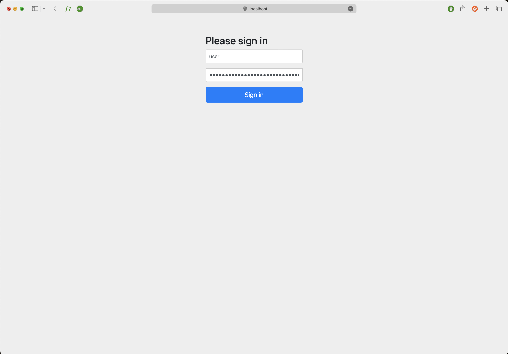
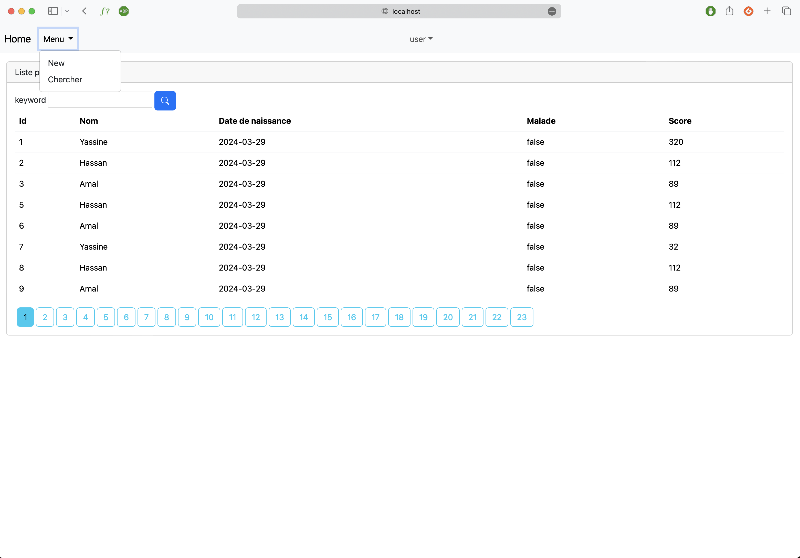

# Hospital Patient Management System

This project is a Hospital Patient Management System designed to handle patient records with functionalities such as adding, editing, deleting, and searching patients. The system is built using Spring Boot and Thymeleaf, providing a user-friendly interface for managing patient data efficiently.

## Features

- **Add Patient**: Allows users to add new patient records to the system.
- **Edit Patient**: Enables users to edit existing patient records with updated information.
- **Delete Patient**: Allows users to delete patient records from the system.
- **Search Patients**: Provides a search functionality to easily find specific patient records based on keywords.

## Screenshots

### Login Page


### Index View (Patient Management)


## Getting Started

To run the project locally, follow these steps:

1. Clone the repository:

   ```
   git clone [<repository-url>](https://github.com/JsFn99/Hopital.git)
   ```

2. Navigate to the project directory:

   ```
   cd Hospital-Patient-Management-System
   ```

3. Build and run the application using Maven:

   ```
   mvn spring-boot:run
   ```

4. Access the application in your web browser at `http://localhost:8080`.

## Technologies Used

- Java
- Spring Boot
- Thymeleaf
- Spring Security


## License

This project is licensed under the [MIT License](LICENSE).
